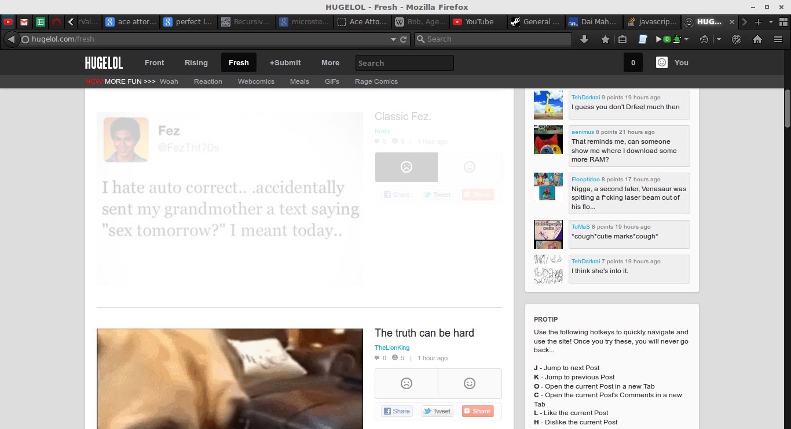
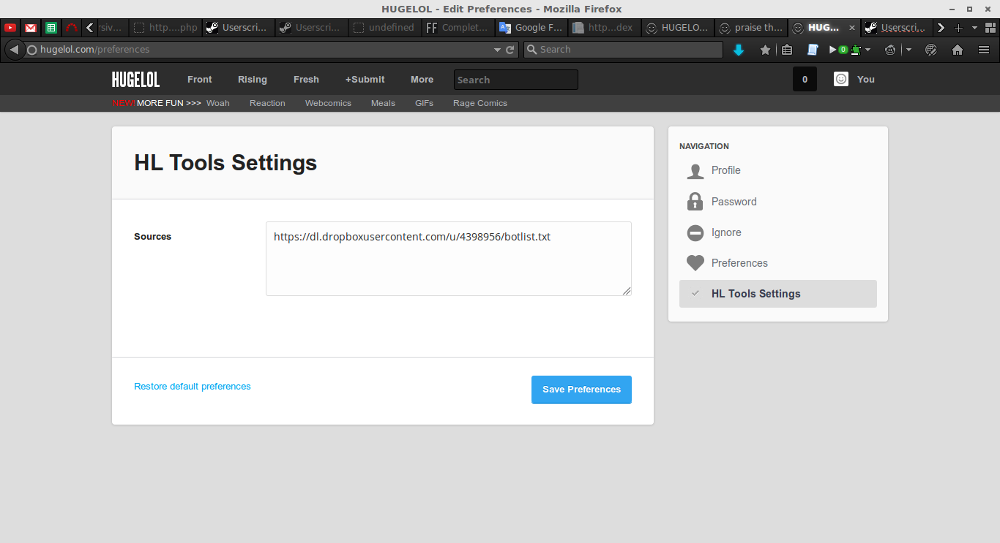

 
:no_entry: [DEPRECATED]

 

# gm_hugelol

* dim posts from bots
* (optional) hide already downvoted posts from bots
* (optional) automatically downvote bot posts as you scroll down (off by default)

I'm not very good with names so I figured it would be useful to create a userscript to identify them for me. This script dims the bot posts from the list your list. It's a good way to visualise the extent of the bot infestation too. Works on all 3 pages and updates with the autoscroll. In some cases it can cancel the auto-ignore prompts too.

In the HL Tools Settings you can turn on the feature to downvote bot posts for you. Fight fire with fire if you will.

## Download

This link will always have the most up to date file: [DOWNLOAD](https://github.com/DAud-IcI/gm_hugelol/raw/master/HUGELOL_Tools.user.js)
If you are using Greasemonkey it will also update itself by checking the same link periodically.

## Install

Install this on a Firefox with Greasemonkey by opening the user script or on Chrome by downloading it and dragging the file into the Extensions page. 

## Configuration

You need to go to the new "HL Tools Settings" item within the Settings menu to add a bot list file, like a public text file from Dropbox:

If you don't have a bot list on your own, it defaults to my list.

It also supporst Steam Forums topics (reads the content of the opening post) and online text files.

## Support

[Discussion and bug reports on the Steam Forums topic here](http://steamcommunity.com/groups/savetheHL1234/discussions/0/541906989396856183/)

